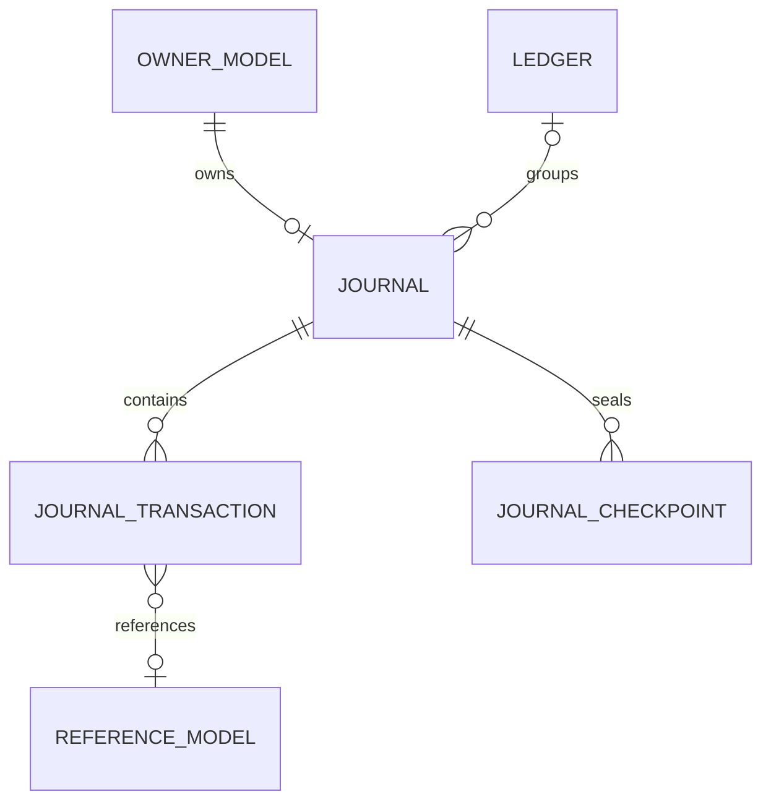
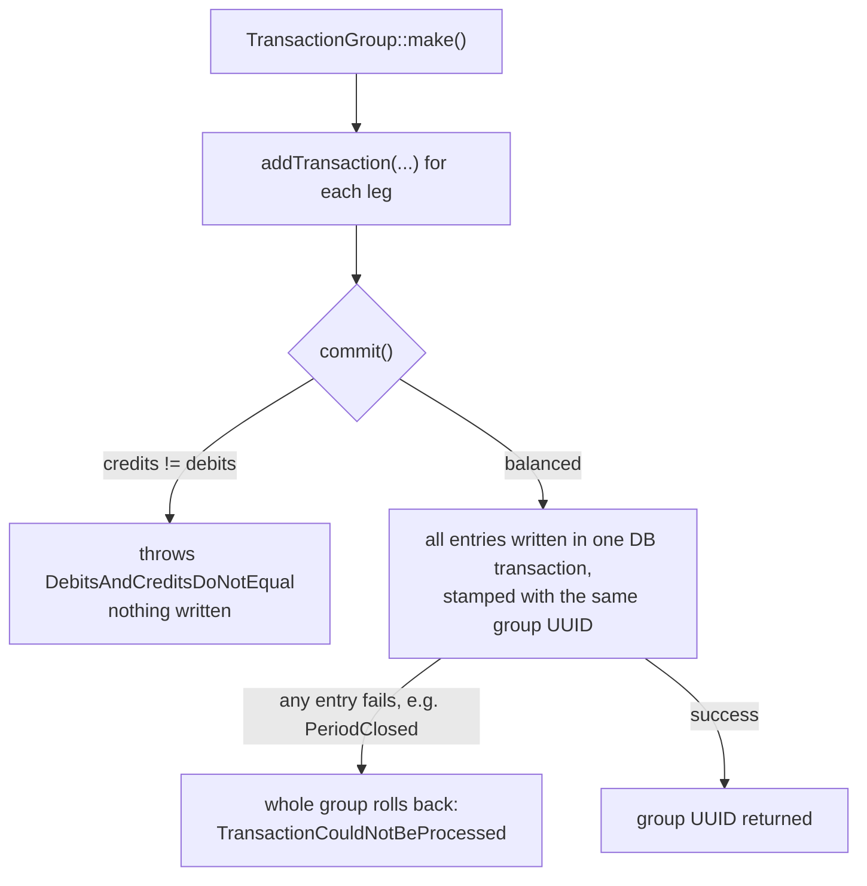
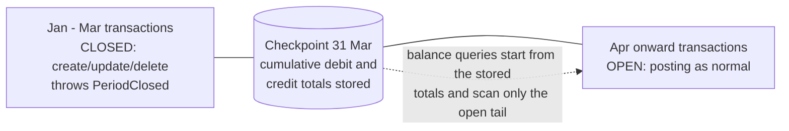

# Laravel Journal

[](https://packagist.org/packages/academe/laravel-journal)
[](https://github.com/academe/laravel-ledger/actions/workflows/ci.yml)
[](https://packagist.org/packages/academe/laravel-journal)
[](LICENSE.txt)

Accounting journals and double-entry bookkeeping for Eloquent models.

Give any Eloquent model its own accounting journal, post credits and debits
to it in [moneyphp/money](https://github.com/moneyphp/money) amounts, read
back running balances, and — when you need it — enforce proper double-entry
bookkeeping across journals grouped into ledgers.

This package is a modernised, journal-centric conversion of
[consilience/accounting](https://github.com/consilience/accounting), itself a
fork of the original [scottlaurent/accounting](https://github.com/scottlaurent/accounting)
package. If you're upgrading from either of those, see [UPGRADE.md](UPGRADE.md).

## Why this package

- **Journal-first, not chart-of-accounts-first.** Attach a journal to any
  Eloquent model with one trait and start posting. There is no world model
  to adopt — no mandatory chart of accounts, entities, or fiscal calendar.
  Ledgers, enforced double entry, and period locking layer on only when you
  need them (see [the three scenarios](#ledgers) below).
- **`moneyphp/money` as the public API.** Amounts go in and come out as
  `Money` value objects; storage is integer minor units. No floats and no
  decimal strings in your application code, and posting the wrong currency
  to a journal fails loudly rather than corrupting a balance.
- **Checkpoints: fast balances and closed periods in one mechanism.** A
  checkpoint stores a journal's cumulative totals through a date and locks
  the period behind it. Balance queries start from the nearest checkpoint
  and scan only what's posted since — a journal with ten years of history
  answers as fast as one with ten days — and the entries behind a
  checkpoint can no longer be edited or deleted.
- **Scales with your rigour.** The same tables serve a single wallet's
  running balance, manual double entry between journals, and
  ledger-enforced double entry across the full accounting equation —
  adopt each level as your application grows into it.

## Structure at a glance



Any model can own a journal (the `HasJournal` owner morph); transactions can
point back at any other model — an invoice, an order, a product — via their
own `reference` morph; checkpoints store a journal's cumulative totals and
lock the period behind them; and journals may — but don't have to — be
grouped under typed ledgers for double-entry reporting.

## Requirements

- PHP 8.2+
- Laravel 12+

## Installation

```bash
composer require academe/laravel-journal

php artisan vendor:publish --tag=journal-config
php artisan vendor:publish --tag=journal-migrations
php artisan migrate
```

The service provider is auto-discovered. The config publish is optional —
the package config is merged automatically. Publishing the migrations is
required on fresh installs: the package deliberately does not auto-load its
migrations, so nothing is created until you publish and run them. If you are
upgrading from consilience/accounting, do **not** run them — use the rename
migration in [UPGRADE.md](UPGRADE.md) instead.

## Quick start

Add the `HasJournal` trait to any model that should own a journal:

```php
use Academe\LaravelJournal\Concerns\HasJournal;
use Illuminate\Database\Eloquent\Model;

class User extends Model
{
    use HasJournal;
}
```

Then initialise a journal and start posting:

```php
use Money\Money;

$user->initJournal('USD');

$transaction = $user->journal->credit(Money::USD(10000), 'Opening credit');
$user->journal->debit(7500);

$balance = $user->journal->currentBalance(); // Money::USD(2500)
```

## How it works

- Each model instance that uses `HasJournal` gets **one journal**, linked via
  a polymorphic `owner` relation (`journals.owner_type` / `owner_id`).
- Amounts are stored as **integer minor units** (cents, pence, and so on),
  using `moneyphp/money`'s `Money` value object as the public API.
- **Credits are positive, debits are negative** when viewed as a signed
  amount: `JournalTransaction::$amount` returns the entry as a single signed
  `Money` value (a credit as positive, a debit as negative). Internally
  they're kept in separate `credit` and `debit` columns.
- `journals.balance` is a **cached column** kept in sync automatically
  whenever a `JournalTransaction` is saved or deleted. The cached value
  equals `totalBalance()` (it includes future-dated transactions), not
  `currentBalance()`.
- **When** the cache is recomputed is configurable via
  `journal.balance_update`:
  - `'on_commit'` (the default): recomputes are batched per journal and run
    just before the surrounding database transaction commits — still inside
    it, so the cache commits atomically with the entries it reflects. A bulk
    import of 100 entries in one transaction costs one recompute, not 100.
    The trade-off: while your own transaction is still open, the cached
    column reads stale; the computed methods (`currentBalance()`,
    `balanceOn()`, `totalBalance()`) are always accurate.
  - `'immediate'`: recomputes synchronously on every save/delete, so the
    cached column is never stale inside your own transaction, at the cost
    of one recompute per entry.
  - Running under Laravel Octane? Add
    `Academe\LaravelJournal\PendingBalanceUpdates::class` to
    `config('octane.flush')` so the batching state is reset between
    requests. Avoid mutating `$transaction->journal` without saving it
    yourself — the deferred recompute persists that instance.
- After posting, the in-memory `$journal` instance's `balance` property is
  stale — the recompute happens on the model that was fetched from the
  database inside the posting call, not on the instance you're holding.
  Call `$journal->fresh()->balance`, or use `currentBalance()` /
  `totalBalance()` / `balanceOn()`, to get an up-to-date value.
- When you post a `Money` value, its currency must match the journal's
  currency, or a `CurrencyMismatch` exception is thrown. When you post a
  plain `int`, it's treated as minor units in the journal's own currency —
  there's nothing to mismatch.
- `journal_transactions.deleted_at` exists in the packaged migration so a
  custom transaction model may opt into `SoftDeletes`; the packaged
  `JournalTransaction` model does not use it.

### Why journals are owned by models

The `journals` table stores no name and no description — a journal's
identity is entirely delegated to its owner. The `owner` morph is
non-nullable and unique per (`owner_type`, `owner_id`) pair, so the
relationship is strictly one-to-one: a `journals` row means nothing on its
own; it is "the journal of `User` #42". The journal contributes only the
bookkeeping state — currency, cached balance, transactions, checkpoints —
while the name, the description, who may see it, and when it is created or
archived all live on the owner, where your application already manages
those concerns.

Owners tend to fall into two camps:

- **Domain objects that naturally have financial state** — the design's
  sweet spot. A `User` with an account balance, a `Wallet`, a `GiftCard`
  with remaining value, an `Order` accruing charges, a driver owed
  payouts. The journal is the answer to "where did this thing's balance
  come from?", reached from the object you already have in hand:
  `$user->journal->currentBalance()`.
- **Stand-in models for pure accounting accounts.** An account that isn't
  a domain object — Cash, Sales, Accounts Receivable — is a small model
  whose rows exist to own journals; that's what `CompanyAccount` is doing
  in the ledger examples below. This is the honest cost of the
  journal-first design: where a chart-of-accounts-first package hands you
  free-standing named accounts, here a named account is a one-line model
  plus a row.

One consequence of the unique index: a model that needs several journals —
a multi-currency wallet, say — can't own them all directly. Introduce a
child model (one row per currency, for example) and hang one journal off
each.

## Balances

`Academe\LaravelJournal\Models\Journal` exposes:

| Method | Meaning |
| --- | --- |
| `currentBalance()` | Balance as of now, excluding future-dated transactions. |
| `balanceOn($date)` | Balance at the end of the given day (a `CarbonInterface`). |
| `totalBalance()` | Balance across *all* transactions, including future-dated ones. |
| `debitBalanceOn($date)` | Debit-only sum at the end of the given day. |
| `creditBalanceOn($date)` | Credit-only sum at the end of the given day. |

All of these return a `Money\Money` instance in the journal's currency. On a
journal with a lot of history, [checkpoint](#checkpoints-fast-balances-and-closed-periods)
periodically so these queries scan only what's posted since the last
checkpoint instead of the full history.

## Referencing models

A `JournalTransaction` can optionally reference any other model — a
product, an invoice, an order — via its own `reference` polymorphic morph:

```php
$transaction = $journal->credit(Money::USD(999), 'Sale');
$transaction->reference()->associate($product)->save();
```

To read transactions back from the referenced model's side, add the
`HasJournalTransactions` trait:

```php
use Academe\LaravelJournal\Concerns\HasJournalTransactions;

class Product extends Model
{
    use HasJournalTransactions;
}

$product->journalTransactions; // Collection<JournalTransaction>
```

## Tags

Each transaction has a `tags` attribute: a flat map of string keys to
scalar values, for labelling entries (`['source' => 'import',
'batch' => 42]`). The shape is deliberately opinionated — tags are labels,
not a document store — so lists, nested arrays, and objects are rejected
with `InvalidTags` on assignment. Reading always gives you an array (an
empty tag set is stored as `NULL` and reads as `[]`):

```php
$transaction->tags = ['status' => 'paid', 'attempts' => 2];
$transaction->save();

$transaction->fresh()->tags; // ['status' => 'paid', 'attempts' => 2]
```

The package never queries tags itself; if you filter on them, add a
driver-appropriate JSON index in your application (the column is `jsonb`
on Postgres).

## Double entry with TransactionGroup

For proper double-entry bookkeeping — where every credit must be balanced by
an equal and opposite debit — build a `TransactionGroup` and commit it
atomically:

```php
use Academe\LaravelJournal\TransactionGroup;
use Money\Money;

// $arJournal: any other journal in the same currency, e.g.
// $arJournal = Account::create(['name' => 'Accounts Receivable'])->initJournal('USD');

$group = TransactionGroup::make()
    ->addTransaction($user->journal, 'credit', Money::USD(50000))
    ->addTransaction($arJournal, 'debit', Money::USD(50000));

$groupUuid = $group->commit();
```

`addTransaction()` also accepts an optional memo, a referenced model, and a
post date: `addTransaction($journal, 'credit', $money, $memo, $reference, $postDate)`.

`commit()`:

- throws `DebitsAndCreditsDoNotEqual` if the queued credits and debits don't
  sum to the same amount;
- writes every entry inside a single database transaction, so the group is
  all-or-nothing;
- stamps every entry in the group with the same `transaction_group` UUID
  (returned by `commit()`), so you can look them up together later;
- wraps any failure in `TransactionCouldNotBeProcessed`, with the original
  exception available via `getPrevious()`.

`addTransaction()` itself throws `InvalidJournalMethod` if given anything
other than `'credit'` or `'debit'`, and `InvalidJournalEntryValue` if the
amount is zero or negative.



## Ledgers

Journals can optionally be grouped under a `Ledger`, typed by the
`StandardLedgerType` enum (`asset`, `liability`, `equity`, `income`,
`expense`) — the five elements of the accounting equation, universal across
UK GAAP, IFRS, and US GAAP. Each type declares its normal balance side
(`Contracts\LedgerType::normalBalance()`), which is all the balance
arithmetic depends on; you can register your own string-backed enums in the
`journal.ledger_types` config array to add types such as contra-accounts.
Ledgers aren't required — plenty of use cases only need a single journal's
running balance. Three common scenarios, from simplest to most rigorous:

### A. Simple running balance per model

Just use `HasJournal` and post directly — no ledger involved:

```php
class Wallet extends Model
{
    use HasJournal;
}

$wallet->initJournal('USD');
$wallet->journal->credit(Money::USD(2000), 'Top up');
$wallet->journal->debit(Money::USD(500), 'Purchase');

$wallet->journal->currentBalance(); // Money::USD(1500)
```

### B. Manual double entry between journals

Post matching credits and debits to two journals yourself, or use
`TransactionGroup` (above) so they're atomic and validated:

```php
$cashJournal = CompanyAccount::create(['name' => 'Cash'])->initJournal('USD');
$arJournal = CompanyAccount::create(['name' => 'Accounts Receivable'])->initJournal('USD');

TransactionGroup::make()
    ->addTransaction($cashJournal, 'debit', Money::USD(10000))
    ->addTransaction($arJournal, 'credit', Money::USD(10000))
    ->commit();
```

### C. Ledger-enforced double entry

Assign journals to typed ledgers, and `Ledger::currentBalance()` gives you a
SQL-aggregated balance across every journal in that ledger. Debit-normal
types (assets, expenses) report **debit − credit**; credit-normal types
(liabilities, equity, income) report **credit − debit** — so, kept balanced,
total assets always equal total liabilities plus equity plus income minus
expenses:

```php
use Academe\LaravelJournal\Enums\StandardLedgerType;
use Academe\LaravelJournal\Models\Ledger;

$assetsLedger = Ledger::create(['name' => 'Assets', 'type' => StandardLedgerType::ASSET]);
$incomeLedger = Ledger::create(['name' => 'Income', 'type' => StandardLedgerType::INCOME]);

$cashJournal = CompanyAccount::create(['name' => 'Cash'])
    ->initJournal('USD')
    ->assignToLedger($assetsLedger);

$salesJournal = CompanyAccount::create(['name' => 'Sales'])
    ->initJournal('USD')
    ->assignToLedger($incomeLedger);

TransactionGroup::make()
    ->addTransaction($cashJournal, 'debit', Money::USD(9900))
    ->addTransaction($salesJournal, 'credit', Money::USD(9900))
    ->commit();

$assetsLedger->currentBalance('USD'); // Money::USD(9900)
$incomeLedger->currentBalance('USD'); // Money::USD(9900)
```

`Ledger::currentBalance()` accepts either a currency code string or a
`Money\Currency` instance, and only sums transactions in that currency —
mixed-currency journals under the same ledger are kept separate.

### Custom ledger types

`journal.ledger_types` is a registry of enum classes, not a single class to
swap out. To add types beyond the standard five, define a string-backed
enum implementing `Academe\LaravelJournal\Contracts\LedgerType` — its one
method, `normalBalance()`, is all the balance arithmetic depends on:

```php
use Academe\LaravelJournal\Contracts\LedgerType;
use Academe\LaravelJournal\Enums\BalanceSide;

enum ContraAssetType: string implements LedgerType
{
    case CONTRA_ASSET = 'contra-asset';

    public function normalBalance(): BalanceSide
    {
        return BalanceSide::Credit; // asset-side account, credit-normal
    }
}
```

Then append it to the registry in `config/journal.php` (publish with
`--tag=journal-config` if you haven't already):

```php
'ledger_types' => [
    Academe\LaravelJournal\Enums\StandardLedgerType::class,
    App\Enums\ContraAssetType::class,
],
```

From there it behaves like any standard type — `Ledger::create(['name' =>
'Accumulated Depreciation', 'type' => ContraAssetType::CONTRA_ASSET])` —
and `Ledger::currentBalance()` signs its result from `normalBalance()`
with no further special-casing.

Things to know:

- The enum's **backing value is the code stored** in `journal_ledgers.type`
  — a plain string column capped at 30 characters, so keep codes within
  that.
- **Codes must be unique across every registered enum.** On read, the
  first registered enum that defines the stored code wins.
- The registry is enforced in both directions: assigning a case from an
  unregistered enum throws `InvalidLedgerType` at write time, and reading
  a row whose stored code no registered enum defines throws it too.
- **Don't strand stored codes.** Every code already stored in
  `journal_ledgers.type` must resolve through some registered enum, or
  reading those rows throws `InvalidLedgerType` — so don't drop
  `StandardLedgerType` from the array while standard-typed rows exist.
- **Replacing `StandardLedgerType` entirely is supported.** Nothing in the
  package references the standard enum concretely — behaviour flows through
  the `LedgerType` interface — so a registry containing only your own enum
  is fine, provided it defines every stored code (redeclare the standard
  backing values, or migrate the column first) and keeps `normalBalance()`
  semantically honest for any code it inherits: redefining `asset` as
  credit-normal silently flips the sign of every existing asset ledger's
  balance. One enum owning all your types is also the clean way to add
  app-level methods such as `label()`, since PHP enums are final and can't
  be extended.

## Checkpoints: fast balances and closed periods

Every balance method — `currentBalance()`, `totalBalance()`, `balanceOn($date)`,
`debitBalanceOn($date)`, `creditBalanceOn($date)` — sums the journal's full
transaction history by default. A **checkpoint** is a stored fixed point:
cumulative debit and credit totals through the end of a given day. Once a
journal has a checkpoint, every balance method starts from the nearest
checkpoint at or before the date in question and scans only the transactions
posted after it. This is entirely internal — no method signatures change,
and existing application code that never calls `checkpoint()` behaves exactly
as before.



### Creating a checkpoint

```php
$checkpoint = $journal->checkpoint('2026-03-31');
// or a Carbon instance: $journal->checkpoint(Carbon::parse('2026-03-31'));
```

`Journal::checkpoint(CarbonInterface|string $date): JournalCheckpoint` totals
every transaction with a `post_date` up to and including the **end of** that
day, and returns the new `Academe\LaravelJournal\Models\JournalCheckpoint`.
The date must be strictly later than the journal's existing latest checkpoint
(compared by calendar day) — passing the same date again, or an earlier one,
throws `InvalidCheckpointDate`. Totals are built incrementally from the
previous checkpoint rather than by re-summing everything from the start, so
checkpointing stays cheap as history grows.

### Closed periods

Creating a checkpoint also **locks** the journal through that date (stored in
`journals.locked_until`). Any attempt to create, update, or delete a
`JournalTransaction` dated on or before the end of the locked date throws
`PeriodClosed` — this covers posting a new backdated entry, editing an
existing entry's amount, memo, or `post_date` (checked against both its
current and its original date), and deleting it outright. Correct a mistake
in a closed period with an adjusting entry dated in the open period, rather
than editing history.

A `TransactionGroup::commit()` that touches a locked journal rolls back
entirely: the whole group fails with `TransactionCouldNotBeProcessed`, and
`getPrevious()` on that exception returns the underlying `PeriodClosed`.

`PeriodClosed` carries the facts as structured, readonly properties —
`$journal` (the locked `Journal` instance), `$lockedUntil`, and `$postDate`
(the offending date) — so applications can catch it and phrase their own
user-facing message instead of parsing the exception string. The wrapper's
message also includes the cause (`Double-entry transaction group could not
be processed: Journal "VAT owed" is closed through 2026-03-31 ...`), so
plain logging of the caught wrapper stays informative. `CurrencyMismatch`
similarly carries `$amountCurrency` and `$journalCurrency`.

#### Naming journals in messages

Wherever the package names a journal (currently exception messages), it
resolves a display name through the journal's owner via
`Journal::displayName()`:

1. If the owner model implements
   `Academe\LaravelJournal\Contracts\NamesJournal` (two methods:
   `journalDisplayName(): string` and `journalDescription(): ?string`),
   its `journalDisplayName()` is used — e.g. `"Margaret Whitfield"`,
   `"VAT owed"`. The interface specifies capabilities, not storage: back
   it with a column, an accessor, whatever fits.
2. Otherwise the fallback is `{type} #{owner_id}` — the morph alias as
   stored in `owner_type` when the app maps one (`customer #7`), or the
   class basename when `owner_type` is a FQCN (`Customer #7`).
3. If the owner row is missing or unloadable: `journal #{id}`.

`Journal::description(): ?string` resolves the same way, returning the
owner's `journalDescription()` — or null when the owner does not
implement `NamesJournal`, has nothing more to say, or is missing.

The owner lookup only happens on failure/display paths, where one
lazy-load query is fine.

The freeze is enforced through the Eloquent models (deliberately — no
database triggers to maintain across drivers), so writes that bypass them,
such as `DB::table(...)` inserts or bulk query-builder updates, are not
guarded. Route all journal writes through the package models.

### Reopening a period

```php
$removed = $journal->removeCheckpointsSince('2026-01-01');
```

One checkpoint can never be removed: an **opening balance** — a checkpoint
with non-zero totals dated before every transaction in its journal (seeded
directly as a brought-forward starting point, e.g. when migrating from
another system). Its totals exist nowhere else, so a removal range that
reaches it throws `CheckpointNotRemovable` before deleting anything.

`Journal::removeCheckpointsSince(CarbonInterface|string $date): int` deletes
every checkpoint dated on or after the given date (inclusive) and returns how
many were removed. Checkpoints can only be removed newest-first — there is no
way to pull one out of the middle of the series — so this reopens the journal
back to whatever checkpoint (if any) is now the latest. Workflow: remove the
checkpoint(s), post corrections, then call `checkpoint()` again; totals are
recomputed fresh from the transactions that exist at that point, not carried
over from the removed checkpoint.

### Ledger bulk operations

```php
$count = $ledger->checkpoint('2026-03-31');               // journals checkpointed
$removed = $ledger->removeCheckpointsSince('2026-01-01');  // checkpoints removed, summed
```

`Ledger::checkpoint(CarbonInterface|string $date): int` and
`Ledger::removeCheckpointsSince(CarbonInterface|string $date): int` apply the
same operation to every journal in the ledger inside one database
transaction: if any member journal fails (for example it already has a later
checkpoint than the one requested), the whole bulk operation rolls back and
none of the ledger's journals are touched. Ledgers store no checkpoint data
of their own — this is a convenience loop over `Journal::checkpoint()` /
`Journal::removeCheckpointsSince()`. A journal with no ledger checkpoints the
same way, on its own.

### Things to know

- **Future-dated checkpoints are allowed.** `checkpoint()` doesn't check the
  date against today — checkpointing a future date locks the journal through
  that date and freezes *all* posting (past, present, and future-dated)
  until the checkpoint is removed. That can be a deliberate hard freeze, but
  it's easy to trigger by mistake; keeping checkpoint dates sane is the
  application's responsibility.
- **Raw `DB::` writes bypass the freeze**, the same way they bypass the
  cached balance column: the `PeriodClosed` guard runs in
  `JournalTransaction`'s Eloquent `creating` / `updating` / `deleting`
  events, so anything that writes to `journal_transactions` without going
  through the Eloquent model — `DB::table(...)->insert()`, a raw query, a
  bulk `update()` — skips both the guard and the balance recompute.
- **Checkpoint only once a period's data is final.** A checkpoint assumes the
  range it covers is complete. If data can arrive late — royalty statements
  landing up to twelve months after the transaction date, for example —
  checkpointing too early means late entries either get rejected by
  `PeriodClosed` or land in the wrong period's totals. Wait until a range is
  closed for good before checkpointing it.

## Configuration

`config/journal.php` (publish with `--tag=journal-config` to customise):

```php
return [
    // ISO 4217 currency code used when a journal is initialised
    // without an explicit currency.
    'base_currency' => 'GBP',

    // Override these to substitute your own model classes.
    // Custom classes should extend the package models.
    'models' => [
        'ledger' => Academe\LaravelJournal\Models\Ledger::class,
        'journal' => Academe\LaravelJournal\Models\Journal::class,
        'transaction' => Academe\LaravelJournal\Models\JournalTransaction::class,
        'checkpoint' => Academe\LaravelJournal\Models\JournalCheckpoint::class,
    ],

    // When to recompute the cached journals.balance column:
    // 'on_commit' (default) batches the recompute — once per journal,
    // just before the surrounding transaction commits; 'immediate'
    // recomputes on every transaction save/delete.
    'balance_update' => 'on_commit',
];
```

Set `models.ledger`, `models.journal`, `models.transaction`, or
`models.checkpoint` to your own subclasses if you need to add scopes, casts,
or relations of your own. See "How it works" above for the
`balance_update` trade-offs.

## Roadmap

Deliberately out of scope for now and planned as follow-up work:

- **Checkpoint extensions** — ledger-level rollup rows, and archiving or
  pruning of old transaction rows once they're safely behind a checkpoint.
- **Open-item assignment and clearing** — allocating settling entries
  (receipts, payments) against outstanding ones (invoices, bills):
  partial allocation, FIFO bulk assignment, and open-item/aging queries.
  An assignment is a new row *about* existing transactions rather than an
  edit to them, so clearing an invoice that sits behind a checkpoint
  composes cleanly with closed periods. Leaning towards shipping this as a
  companion package layered on top of this one, keeping the core to pure
  bookkeeping mechanics.

## Licence

MIT. See [LICENSE.txt](LICENSE.txt).
