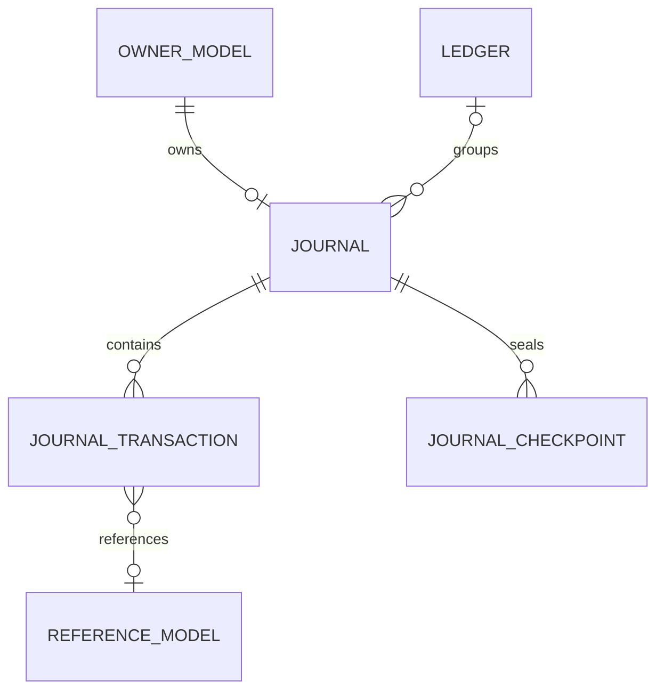

# Laravel Journal

[](https://packagist.org/packages/academe/laravel-journal)
[](https://github.com/academe/laravel-ledger/actions/workflows/ci.yml)
[](https://packagist.org/packages/academe/laravel-journal)
[](LICENSE.txt)

Accounting journals and double-entry bookkeeping for Eloquent models.

Give any Eloquent model its own accounting journal, post credits and debits
to it in [moneyphp/money](https://github.com/moneyphp/money) amounts, read
back running balances, and — when you need it — enforce proper double-entry
bookkeeping across journals grouped into ledgers.

This package is a modernised, journal-centric conversion of
[consilience/accounting](https://github.com/consilience/accounting), itself a
fork of the original [scottlaurent/accounting](https://github.com/scottlaurent/accounting)
package. If you're upgrading from either of those, see [UPGRADE.md](UPGRADE.md).

## Why this package

- **Journal-first, not chart-of-accounts-first.** Attach a journal to any
  Eloquent model with one trait and start posting. There is no world model
  to adopt — no mandatory chart of accounts, entities, or fiscal calendar.
  Ledgers, enforced double entry, and period locking layer on only when you
  need them (see [the three scenarios](docs/ledgers.md)).
- **`moneyphp/money` as the public API.** Amounts go in and come out as
  `Money` value objects; storage is integer minor units. No floats and no
  decimal strings in your application code, and posting the wrong currency
  to a journal fails loudly rather than corrupting a balance.
- **Checkpoints: fast balances and closed periods in one mechanism.** A
  checkpoint stores a journal's cumulative totals through a date and locks
  the period behind it. Balance queries start from the nearest checkpoint
  and scan only what's posted since — a journal with ten years of history
  answers as fast as one with ten days — and the entries behind a
  checkpoint can no longer be edited or deleted.
- **Scales with your rigour.** The same tables serve a single wallet's
  running balance, manual double entry between journals, and
  ledger-enforced double entry across the full accounting equation —
  adopt each level as your application grows into it.

## Structure at a glance



Any model can own a journal (the `HasJournal` owner morph); transactions can
point back at any other model — an invoice, an order, a product — via their
own `reference` morph; checkpoints store a journal's cumulative totals and
lock the period behind them; and journals may — but don't have to — be
grouped under typed ledgers for double-entry reporting.

## Requirements

- PHP 8.2+
- Laravel 12+

## Installation

```bash
composer require academe/laravel-journal

php artisan vendor:publish --tag=journal-config
php artisan vendor:publish --tag=journal-migrations
php artisan migrate
```

The service provider is auto-discovered. The config publish is optional —
the package config is merged automatically. Publishing the migrations is
required on fresh installs: the package deliberately does not auto-load its
migrations, so nothing is created until you publish and run them. If you are
upgrading from consilience/accounting, do **not** run them — use the rename
migration in [UPGRADE.md](UPGRADE.md) instead.

## Quick start

Add the `HasJournal` trait to any model that should own a journal:

```php
use Academe\LaravelJournal\Concerns\HasJournal;
use Illuminate\Database\Eloquent\Model;

class User extends Model
{
    use HasJournal;
}
```

Then initialise a journal and start posting:

```php
use Money\Money;

$user->initJournal('USD');

$transaction = $user->journal->credit(Money::USD(10000), 'Opening credit');
$user->journal->debit(7500);

$balance = $user->journal->currentBalance(); // Money::USD(2500)
```

To give every new instance of a model a journal automatically, call
`initJournal()` from the model's `created` event instead of by hand:

```php
class User extends Model
{
    use HasJournal;

    protected static function booted(): void
    {
        static::created(fn (self $user) => $user->initJournal());
    }
}
```

With no arguments, `initJournal()` uses `config('journal.base_currency')`.

## How it works

- Each model instance that uses `HasJournal` gets **one journal**, linked via
  a polymorphic `owner` relation (`journals.owner_type` / `owner_id`).
- Amounts are stored as **integer minor units** (cents, pence, and so on),
  using `moneyphp/money`'s `Money` value object as the public API.
- **Credits are positive, debits are negative** when viewed as a signed
  amount: `JournalTransaction::$amount` returns the entry as a single signed
  `Money` value (a credit as positive, a debit as negative). Internally
  they're kept in separate `credit` and `debit` columns.
- `journals.balance` is a **cached column** kept in sync automatically
  whenever a `JournalTransaction` is saved or deleted. The cached value
  equals `totalBalance()` (it includes future-dated transactions), not
  `currentBalance()`.

The finer points live in the focused pages below: when the cached balance
is recomputed and how stale instances behave in
[balances](docs/balances.md) and [configuration](docs/configuration.md),
and currency guarding on posting in [double entry](docs/double-entry.md).

### Why journals are owned by models

The `journals` table stores no name and no description — a journal's
identity is entirely delegated to its owner. The `owner` morph is
non-nullable and unique per (`owner_type`, `owner_id`) pair, so the
relationship is strictly one-to-one: a `journals` row means nothing on its
own; it is "the journal of `User` #42". The journal contributes only the
bookkeeping state — currency, cached balance, transactions, checkpoints —
while the name, the description, who may see it, and when it is created or
archived all live on the owner, where your application already manages
those concerns.

Owners tend to fall into two camps:

- **Domain objects that naturally have financial state** — the design's
  sweet spot. A `User` with an account balance, a `Wallet`, a `GiftCard`
  with remaining value, an `Order` accruing charges, a driver owed
  payouts. The journal is the answer to "where did this thing's balance
  come from?", reached from the object you already have in hand:
  `$user->journal->currentBalance()`.
- **Stand-in models for pure accounting accounts.** An account that isn't
  a domain object — Cash, Sales, Accounts Receivable — is a small model
  whose rows exist to own journals; that's what `CompanyAccount` is doing
  in the [ledger examples](docs/ledgers.md). This is the honest cost of the
  journal-first design: where a chart-of-accounts-first package hands you
  free-standing named accounts, here a named account is a one-line model
  plus a row.

One consequence of the unique index: a model that needs several journals —
a multi-currency wallet, say — can't own them all directly. Introduce a
child model (one row per currency, for example) and hang one journal off
each.

## Documentation

Focused guides live under [docs/](docs/):

- [Balances](docs/balances.md) — the balance methods, and the staleness of
  the cached column after posting.
- [Formatting and parsing amounts](docs/money-formatting.md) — the
  `MoneyFormatter` helper: `Money` to string and back, plain or
  locale-aware.
- [Referencing models](docs/references.md) — linking transactions to
  invoices, orders, products.
- [Tags](docs/tags.md) — labelling transactions with key/value metadata.
- [Double entry](docs/double-entry.md) — atomic `TransactionGroup` commits,
  fetching a group, reversing a group.
- [Multiple currencies](docs/multi-currency.md) — running more than one
  currency, FX clearing journals, realised and unrealised gains.
- [Ledgers](docs/ledgers.md) — grouping journals under typed ledgers, the
  three usage scenarios, custom ledger types.
- [Checkpoints](docs/checkpoints.md) — fast balances, closed periods,
  reopening a period.
- [Exceptions](docs/exceptions.md) — the exception hierarchy and what each
  exception carries.
- [Configuration](docs/configuration.md) — `config/journal.php`: base
  currency, model substitution, balance-cache timing, soft deletes.

Upgrading from consilience/accounting or scottlaurent/accounting, or
between versions of this package: [UPGRADE.md](UPGRADE.md).

## Roadmap

Planned follow-up work:

- **Checkpoint follow-ons** — ledger-level rollup rows, and archiving or
  pruning of old transaction rows once they're safely behind a checkpoint.

The core stays pure bookkeeping mechanics: higher-level accounting
concepts — invoices, payments, allocation and clearing — are for
packages layered on top, not this one.

## Licence

MIT. See [LICENSE.txt](LICENSE.txt).
