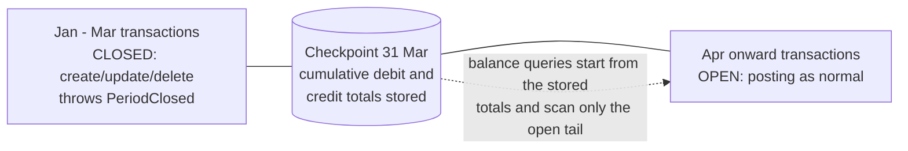

# Checkpoints: fast balances and closed periods

[← Back to README](../README.md)

Every balance method — `currentBalance()`, `totalBalance()`, `balanceOn($date)`,
`debitBalanceOn($date)`, `creditBalanceOn($date)` — sums the journal's full
transaction history by default. A **checkpoint** is a stored fixed point:
cumulative debit and credit totals through the end of a given day. Once a
journal has a checkpoint, every balance method starts from the nearest
checkpoint at or before the date in question and scans only the transactions
posted after it. This is entirely internal — no method signatures change,
and existing application code that never calls `checkpoint()` behaves exactly
as before.



## Creating a checkpoint

```php
$checkpoint = $journal->checkpoint('2026-03-31');
// or a Carbon instance: $journal->checkpoint(Carbon::parse('2026-03-31'));
```

`Journal::checkpoint(CarbonInterface|string $date): JournalCheckpoint` totals
every transaction with a `post_date` up to and including the **end of** that
day, and returns the new `Academe\LaravelJournal\Models\JournalCheckpoint`.
The date must be strictly later than the journal's existing latest checkpoint
(compared by calendar day) — passing the same date again, or an earlier one,
throws `InvalidCheckpointDate`. Totals are built incrementally from the
previous checkpoint rather than by re-summing everything from the start, so
checkpointing stays cheap as history grows.

## Closed periods

Creating a checkpoint also **locks** the journal through that date (stored in
`journals.locked_until`). Any attempt to create, update, or delete a
`JournalTransaction` dated on or before the end of the locked date throws
`PeriodClosed` — this covers posting a new backdated entry, editing an
existing entry's amount, memo, or `post_date` (checked against both its
current and its original date), and deleting it outright. Correct a mistake
in a closed period with an adjusting entry dated in the open period, rather
than editing history.

A `TransactionGroup::commit()` that touches a locked journal rolls back
entirely: the whole group fails with `TransactionCouldNotBeProcessed`, and
`getPrevious()` on that exception returns the underlying `PeriodClosed`.

`PeriodClosed` carries the facts as structured, readonly properties —
`$journal` (the locked `Journal` instance), `$lockedUntil`, and `$postDate`
(the offending date) — so applications can catch it and phrase their own
user-facing message instead of parsing the exception string. The wrapper's
message also includes the cause (`Double-entry transaction group could not
be processed: Journal "VAT owed" is closed through 2026-03-31 ...`), so
plain logging of the caught wrapper stays informative. `CurrencyMismatch`
similarly carries `$amountCurrency` and `$journalCurrency`.

### Naming journals in messages

Wherever the package names a journal (currently exception messages), it
resolves a display name through the journal's owner via
`Journal::displayName()`:

1. If the owner model implements
   `Academe\LaravelJournal\Contracts\NamesJournal` (two methods:
   `journalDisplayName(): string` and `journalDescription(): ?string`),
   its `journalDisplayName()` is used — e.g. `"Margaret Whitfield"`,
   `"VAT owed"`. The interface specifies capabilities, not storage: back
   it with a column, an accessor, whatever fits.
2. Otherwise the fallback is `{type} #{owner_id}` — the morph alias as
   stored in `owner_type` when the app maps one (`customer #7`), or the
   class basename when `owner_type` is a FQCN (`Customer #7`).
3. If the owner row is missing or unloadable: `journal #{id}`.

`Journal::description(): ?string` resolves the same way, returning the
owner's `journalDescription()` — or null when the owner does not
implement `NamesJournal`, has nothing more to say, or is missing.

The owner lookup only happens on failure/display paths, where one
lazy-load query is fine.

The freeze is enforced through the Eloquent models (deliberately — no
database triggers to maintain across drivers), so writes that bypass them,
such as `DB::table(...)` inserts or bulk query-builder updates, are not
guarded. Route all journal writes through the package models.

## Reopening a period

```php
$removed = $journal->removeCheckpointsSince('2026-01-01');
```

One checkpoint can never be removed: an **opening balance** — a checkpoint
with non-zero totals dated before every transaction in its journal (seeded
directly as a brought-forward starting point, e.g. when migrating from
another system). Its totals exist nowhere else, so a removal range that
reaches it throws `CheckpointNotRemovable` before deleting anything.

`Journal::removeCheckpointsSince(CarbonInterface|string $date): int` deletes
every checkpoint dated on or after the given date (inclusive) and returns how
many were removed. Checkpoints can only be removed newest-first — there is no
way to pull one out of the middle of the series — so this reopens the journal
back to whatever checkpoint (if any) is now the latest. Workflow: remove the
checkpoint(s), post corrections, then call `checkpoint()` again; totals are
recomputed fresh from the transactions that exist at that point, not carried
over from the removed checkpoint.

## Ledger bulk operations

```php
$count = $ledger->checkpoint('2026-03-31');               // journals checkpointed
$removed = $ledger->removeCheckpointsSince('2026-01-01');  // checkpoints removed, summed
```

`Ledger::checkpoint(CarbonInterface|string $date): int` and
`Ledger::removeCheckpointsSince(CarbonInterface|string $date): int` apply the
same operation to every journal in the ledger inside one database
transaction: if any member journal fails (for example it already has a later
checkpoint than the one requested), the whole bulk operation rolls back and
none of the ledger's journals are touched. Ledgers store no checkpoint data
of their own — this is a convenience loop over `Journal::checkpoint()` /
`Journal::removeCheckpointsSince()`. A journal with no ledger checkpoints the
same way, on its own.

## Things to know

- **Future-dated checkpoints are allowed.** `checkpoint()` doesn't check the
  date against today — checkpointing a future date locks the journal through
  that date and freezes *all* posting (past, present, and future-dated)
  until the checkpoint is removed. That can be a deliberate hard freeze, but
  it's easy to trigger by mistake; keeping checkpoint dates sane is the
  application's responsibility.
- **Raw `DB::` writes bypass the freeze**, the same way they bypass the
  cached balance column: the `PeriodClosed` guard runs in
  `JournalTransaction`'s Eloquent `creating` / `updating` / `deleting`
  events, so anything that writes to `journal_transactions` without going
  through the Eloquent model — `DB::table(...)->insert()`, a raw query, a
  bulk `update()` — skips both the guard and the balance recompute.
- **Checkpoint only once a period's data is final.** A checkpoint assumes the
  range it covers is complete. If data can arrive late — royalty statements
  landing up to twelve months after the transaction date, for example —
  checkpointing too early means late entries either get rejected by
  `PeriodClosed` or land in the wrong period's totals. Wait until a range is
  closed for good before checkpointing it.
