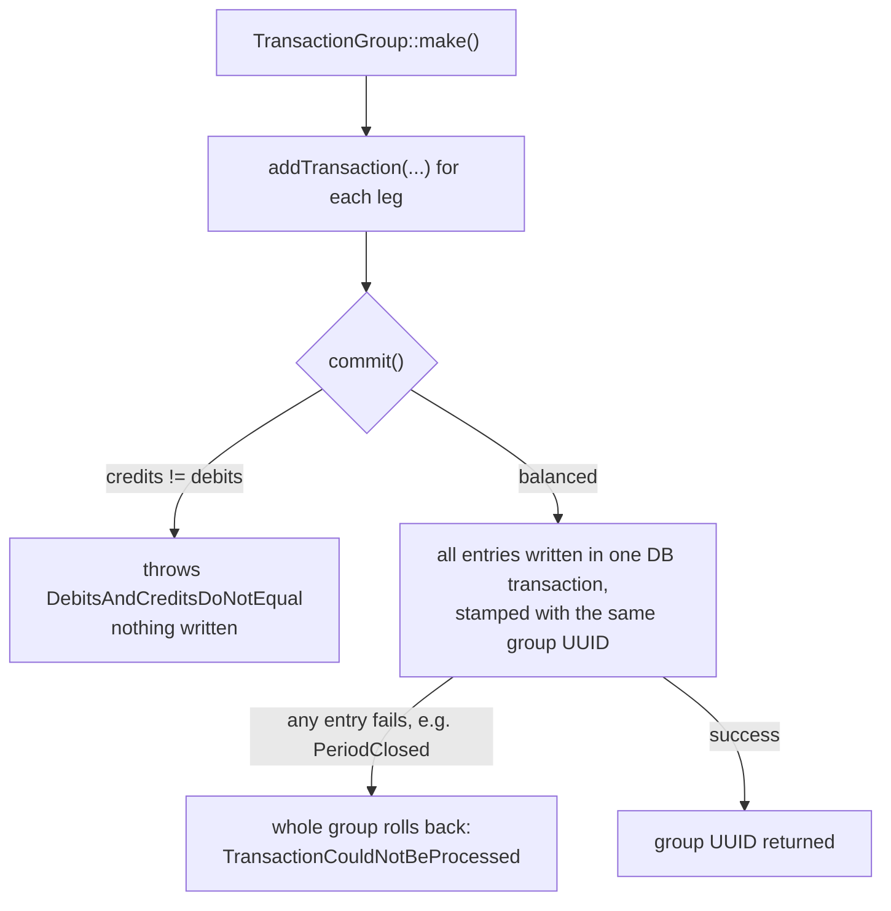

# Double entry with TransactionGroup

[← Back to README](../README.md)

For proper double-entry bookkeeping — where every credit must be balanced by
an equal and opposite debit — build a `TransactionGroup` and commit it
atomically:

```php
use Academe\LaravelJournal\TransactionGroup;
use Money\Money;

// $arJournal: any other journal in the same currency, e.g.
// $arJournal = Account::create(['name' => 'Accounts Receivable'])->initJournal('USD');

$group = TransactionGroup::make()
    ->addTransaction($user->journal, 'credit', Money::USD(50000))
    ->addTransaction($arJournal, 'debit', Money::USD(50000));

$groupUuid = $group->commit();
```

When you post a `Money` value — directly through `credit()` / `debit()` or
through a group — its currency must match the journal's currency, or a
`CurrencyMismatch` exception is thrown. When you post a plain `int`, it's
treated as minor units in the journal's own currency — there's nothing to
mismatch.

`addTransaction()` also accepts an optional memo, a referenced model, and a
post date: `addTransaction($journal, 'credit', $money, $memo, $reference, $postDate)`.

The method argument takes an `Academe\LaravelJournal\Enums\EntryType` case
(`EntryType::Credit` / `EntryType::Debit`) or its string value as shown
above — the strings are normalised to the enum internally, so both forms
are equivalent.

`commit()`:

- throws `DebitsAndCreditsDoNotEqual` if the queued credits and debits don't
  sum to the same amount;
- writes every entry inside a single database transaction, so the group is
  all-or-nothing;
- stamps every entry in the group with the same `transaction_group` UUID
  (returned by `commit()`), so you can look them up together later;
- wraps any failure in `TransactionCouldNotBeProcessed`, with the original
  exception available via `getPrevious()`.

`DebitsAndCreditsDoNotEqual` is itself a subclass of
`TransactionCouldNotBeProcessed`, so catching the latter covers every way
`commit()` can fail (the unbalanced case carries no `getPrevious()` —
nothing reached the database).

`addTransaction()` itself throws `InvalidJournalMethod` if given a string
other than `'credit'` or `'debit'`, and `InvalidJournalEntryValue` if the
amount is zero or negative.

## Fetching a group

The entries committed together share the group UUID, so they can be
retrieved together with the `whereGroup` scope:

```php
$entries = JournalTransaction::whereGroup($groupUuid)->get();
```

## Reversing a group

`TransactionGroup::reverse($groupUuid)` builds the mirror image of a
committed group — one entry per original with credits and debits swapped —
as a new, uncommitted `TransactionGroup`:

```php
$reversal = TransactionGroup::reverse($groupUuid);
// inspect via $reversal->pending(), or add further entries...
$reversalUuid = $reversal->commit();
```

Nothing is posted until `commit()`. The reversal entries post as of an
optional second argument (`reverse($groupUuid, $postDate)`), defaulting to
now; each keeps its original's referenced model, and its memo becomes
`Reversal: {original memo}` (or `Reversal of transaction group {uuid}` when
the original had none). An unknown UUID throws `TransactionGroupNotFound`,
which carries the UUID as a `$transactionGroup` property.

This is the closed-period-safe way to undo a group: the original entries
stay untouched — they may be frozen behind a checkpoint — and the
correction lands in the open period as its own balanced group.



## Multiple currencies

Each journal is fixed to one currency, and groups must balance within
each currency they touch — so moving value between currencies is a
four-leg group routed through per-currency FX clearing journals, with
the exchange rate staying application data. The full pattern, including
where realised and unrealised gains end up, is worked through in
[multi-currency.md](multi-currency.md).
