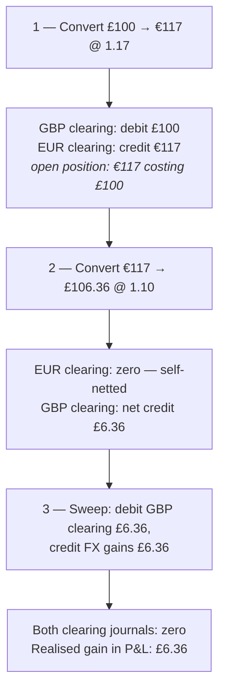
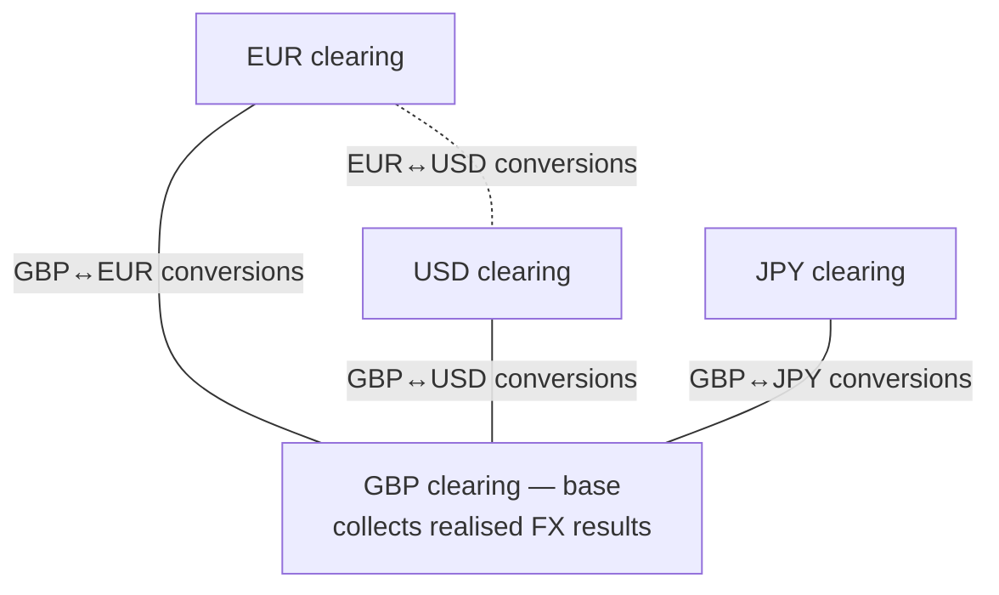

# Multiple currencies

[← Back to README](../README.md)

How to run more than one currency through `academe/laravel-journal`, and
how to move value between journals of different currencies — including
where the exchange-rate gain or loss ends up.

Everything in this guide works with the package as-is: it is a usage
pattern built from ordinary transaction groups, not a package feature.

## The currency model

The package's rules, stated once:

- **One currency per journal.** `journals.currency_code` is fixed at
  creation. Posting a `Money` in any other currency throws
  `CurrencyMismatch`; a plain integer always means minor units of the
  journal's own currency.
- **One journal per owner model.** The `journals` table has a unique
  constraint on (`owner_type`, `owner_id`), so an entity that operates
  in three currencies needs three owner rows — for example one `Wallet`
  model instance per currency, each with its own journal.
- **Groups balance per currency.** `TransactionGroup::commit()`
  requires credits to equal debits *within each currency* in the group.
  A numerically balanced cross-currency pair (`credit USD 100` /
  `debit EUR 100`) is rejected with `DebitsAndCreditsDoNotEqual`; a
  group containing several currencies commits when each balances
  independently.
- **Reporting is per currency.** `Ledger::currentBalance('USD')` sums
  only USD journals; nothing ever adds amounts across currencies.
- **The package knows nothing about exchange rates.** Rates are
  volatile market data, not bookkeeping; they stay in your application
  (see [Where the rate lives](#where-the-rate-lives)).

The net effect: each currency is a self-consistent set of books that
happens to share tables.

## The conversion pattern: FX clearing journals

Because a two-leg cross-currency entry can never balance, a conversion
is one atomic group with **four legs**, routed through a pair of
**FX clearing journals** — company-owned accounts, one per currency.

Converting £100 into euros at a rate of 1.17:

```php
use Academe\LaravelJournal\Enums\EntryType;
use Academe\LaravelJournal\TransactionGroup;
use Money\Money;

TransactionGroup::make()
    ->addTransaction($gbpWallet,     EntryType::Credit, Money::GBP(10000))
    ->addTransaction($fxClearingGbp, EntryType::Debit,  Money::GBP(10000))
    ->addTransaction($fxClearingEur, EntryType::Credit, Money::EUR(11700))
    ->addTransaction($eurWallet,     EntryType::Debit,  Money::EUR(11700))
    ->commit();
```

GBP balances within the group (£100 = £100) and EUR balances within the
group (€117 = €117), so it commits — atomically, all four legs stamped
with one group UUID. `TransactionGroup::reverse()` undoes the whole
conversion in one call.


Money never crosses the dashed line. The rate decides the *sizes* of
the two same-currency movements; it is not itself an entry.

## What the clearing balances mean

After that conversion the clearing journals hold:

| Journal | Balance | Reading |
| --- | --- | --- |
| GBP FX clearing | debit £100 | what the position cost |
| EUR FX clearing | credit €117 | the euros issued against it |

These are not dangling errors — together they *are* the open currency
position: "€117 held, which cost £100". As long as you hold the euros,
that is exactly what the books should say.

## The round trip: where the gain or loss appears

Convert the €117 back later, when the rate has moved to 1.10, receiving
£106.36. The mirror group posts (EUR clearing debited €117, GBP
clearing credited £106.36), and the clearing balances become:

| Journal | Step 1: £100 → €117 @ 1.17 | Step 2: €117 → £106.36 @ 1.10 | Net |
| --- | --- | --- | --- |
| GBP FX clearing | debit £100 | credit £106.36 | **credit £6.36** |
| EUR FX clearing | credit €117 | debit €117 | **zero** |

Two things happened by construction, with nothing computing them:

- **The foreign-side clearing self-nets.** €117 in, €117 out — in its
  own currency nothing was gained or lost, because a euro is a euro.
- **The base-side residual is the realised FX gain.** £106.36 came back
  against the £100 that went out. Had the rate moved the other way, the
  residual would be a debit — a realised loss.

## Sweeping the residual to P&L

The residual is cleared with one ordinary, single-currency group:

```php
TransactionGroup::make()
    ->addTransaction($fxClearingGbp, EntryType::Debit,  Money::GBP(636))
    ->addTransaction($fxGains,       EntryType::Credit, Money::GBP(636))
    ->commit();
```

`$fxGains` is a plain GBP journal in an income ledger (use an expense
journal for losses). Sweep per conversion, monthly, or whenever suits —
the sweep is plain bookkeeping and composes with checkpoints, closed
periods, and reversal like any other entry.



Lifecycle in one sentence: **the foreign-side clearing nets to zero
whenever a position round-trips; the base-side clearing accumulates
exactly the realised gain or loss, which you sweep to P&L.**

## Positions that never round-trip

If you keep holding the euros, the clearing balances persist —
correctly — as the position and its cost basis. To make period-end
accounts reflect the current rate, post an *unrealised* revaluation:
translate the EUR clearing balance at the closing rate, compare with
the GBP clearing balance, and post the difference — in GBP only —
between GBP clearing and an unrealised-gains journal.

At a closing rate of 1.10, the €117 position is worth £106.36 against
its £100 cost:

```php
TransactionGroup::make()
    ->addTransaction($fxClearingGbp,   EntryType::Debit,  Money::GBP(636))
    ->addTransaction($fxUnrealised,    EntryType::Credit, Money::GBP(636))
    ->commit();
```

The EUR books are never touched by revaluation — in euros, nothing
changed. Reverse or re-post the revaluation next period as your
accounting policy dictates (`TransactionGroup::reverse()` makes the
classic reversing-entry pattern one call).

## Where the rate lives

The package has nowhere to put a rate, deliberately. Two natural homes
it already provides:

- **Tags** on each leg:
  `['fx_rate' => '1.17', 'fx_pair' => 'GBPEUR']` — queryable, stored on
  the entries themselves.
- **A reference model**: point all four legs at your own
  `CurrencyConversion` model via the `$reference` argument. The legs
  are then queryable as one conversion event, alongside the group UUID.

## Ledger placement

- Wallet/cash journals and both clearing journals belong in **asset**
  ledgers — the clearing accounts are part of your cash position,
  jointly.
- Sweep targets (`fxGains`, `fxLosses`, `fxUnrealised`) belong in
  **income**/**expense** ledgers.

That keeps `Ledger::currentBalance($currency)` truthful throughout:
every currency's accounting equation holds at every step.

## Scaling to many currencies

One clearing journal per currency; every conversion touches exactly
two of them. Conversions involving the base currency leave their
realised results in the base clearing account; a conversion between two
foreign currencies (EUR↔USD) nets those two clearing accounts against
each other, and its result surfaces in base currency when either
position eventually closes.



Keeping all realised FX results funnelling into one base clearing
account gives audits a single place to look.
